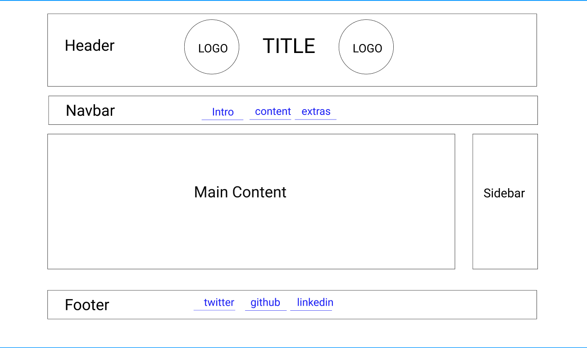

# Design

## Project's Design Overview

The "All About Trees" website is designed to be visually engaging,
user-friendly, and educational, aligning with its goal to raise awareness about
tree conservation. The design focuses on simplicity and accessibility, ensuring
users can easily find information while enjoying an aesthetically pleasing
experience.

---

## Wireframe(s)

